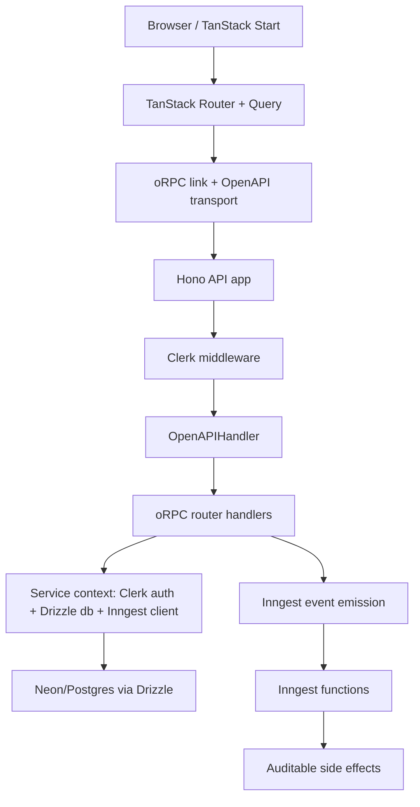
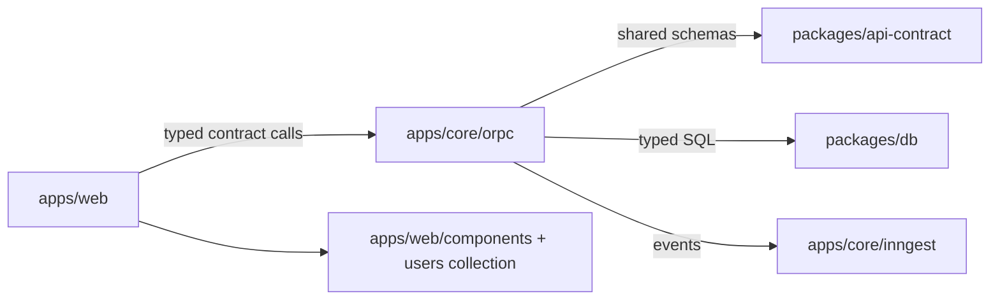

# Onboarder Technical Specification (Current State)

Last updated: 2026-06-11

## Purpose of this document

This document captures how each major technology is wired in the current repository so a new teammate can onboard quickly and avoid crossing architecture boundaries.

The system is intentionally small and explicit:

1. user intent starts in `apps/web`,
2. API work is driven by typed contracts in `packages/api-contract`,
3. execution and persistence happen in `apps/core`,
4. async signals flow through `Inngest`.

## System architecture





## Tech-by-tech setup and usage

### 1) Contract-first API (`@orpc/contract`, `packages/api-contract`)

Why:

- Prevents drift between web and API code.
- Enforces request/response shapes with Zod at the edge.
- Gives OpenAPI generation for docs and tooling.

How it is set up:

- `packages/api-contract/src/contracts/users.ts` defines all user procedures.
- `packages/api-contract/src/contracts/index.ts` exports `contract` as the app-wide source.
- `packages/api-contract/src/index.ts` exports `AppClient` typed client shape from `ContractRouterClient`.

Example:

```ts
export const usersContract = {
	byId: oc
		.route({ method: "GET", path: "/users/{id}" })
		.input(UserByIdInputSchema)
		.output(UserSchema.nullable()),
	create: oc
		.route({ method: "POST", path: "/users" })
		.input(CreateUserInputSchema)
		.output(UserSchema),
}
```

Why this matters now:

- Every place reading users (`users/route`, API handlers, and Inngest payloads) can stay type-safe under one contract object.

### 2) Web shell and routing (`@tanstack/react-start`, `@tanstack/react-router`)

Why:

- SSR + client transitions are in one app.
- Route tree is generated with strongly typed route metadata.
- Supports preload + query hydration for fast route-level data.

How it is set up:

- `apps/web/src/start.ts` applies Clerk middleware to server request handling.
- `apps/web/src/router.tsx` builds the TanStack Router and links QueryClient defaults.
- `apps/web/src/routes/__root.tsx` wires root document structure and devtools.
- `apps/web/src/routes/users.tsx` uses `beforeLoad` server fn for auth and route-level data preloading.

Example:

```ts
export const Route = createFileRoute("/users")({
	beforeLoad: () => requireAuth(),
	loader: ({ context }) => context.queryClient.ensureQueryData(usersListQuery),
	component: UsersPage,
})
```

### 3) Typed API transport in web (`@orpc/client`, `@orpc/openapi-client`)

Why:

- Same transport is used for browser and SSR.
- Automatically injects Clerk token on browser calls and server request headers for SSR.

How it is set up:

- `apps/web/src/lib/orpc.ts` creates a single `client` using `createIsomorphicFn`.
- Browser client injects `Authorization: Bearer <clerk-token>`.
- SSR client injects request headers via `getRequestHeaders()`.

Example:

```ts
const getLink = createIsomorphicFn()
	.client(
		() =>
			new OpenAPILink(contract, {
				fetch: async (request, init) => {
					const token = await getClerkToken()
					const headers = new Headers(init?.headers)
					if (token) headers.set("Authorization", `Bearer ${token}`)
					return fetch(request, { ...init, headers })
				},
				url: `${env.VITE_API_ORIGIN}/api`,
			}),
	)
	.server(
		() =>
			new OpenAPILink(contract, {
				headers: () => getRequestHeaders(),
				url: `${env.API_ORIGIN}/api`,
			}),
	)
```

### 4) Querying + local cache (`@tanstack/react-query`, `@orpc/tanstack-query`)

Why:

- Predictable fetch lifecycle.
- Reuseable query utilities from oRPC contract directly.

How it is set up:

- `apps/web/src/lib/orpc-query.ts` creates `createTanstackQueryUtils`.
- `apps/web/src/router.tsx` configures shared `QueryClient` defaults (stale times, GC time).
- Route loader in `/users` preloads `usersListQuery`.

Example:

```ts
export const usersListQuery = orpc.users.list.queryOptions({ input: { cursor: 0, limit: 20 } })
useSuspenseQuery(usersListQuery)
```

### 5) Local-first writes (`@tanstack/react-db`, `@tanstack/query-db-collection`)

Why:

- Keeps UI responsive with optimistic inserts.
- Centralizes eventual reconciliation with API response.

How it is set up:

- `apps/web/src/lib/db` holds singleton DB collection creation.
- `apps/web/src/entities/users/user.collection.ts` defines `onInsert` behavior.

Example:

```ts
onInsert: async ({ collection, transaction }) => {
	const createdUsers = await Promise.all(
		transaction.mutations.map((mutation) =>
			client.users.create(toCreateUserInput(mutation.modified)),
		),
	)
	collection.utils.writeBatch(() => {
		collection.utils.writeDelete(temporaryIds)
		collection.utils.writeUpsert(createdUsers)
	})
}
```

### 6) API server (`hono`, `@orpc/server`, `@orpc/openapi`)

Why:

- Fast, edge-compatible HTTP host.
- Native OpenAPI generation and typed handler execution.

How it is set up:

- `apps/core/src/index.ts` creates a Hono app and mounts:
  - health routes,
  - OpenAPI docs routes,
  - CORS + Clerk middleware for `/api/*`,
  - oRPC OpenAPI handler.
- `apps/core/src/orpc/router.ts` uses `implement(contract).$context<ORPCContext>()` for typed handlers and shared context injection.

Example:

```ts
app.use("/api/*", clerkMiddleware()).use("/api/*", async (c, next) => {
	const { matched, response } = await openApiHandler.handle(c.req.raw, {
		context: createProcedureContext(c),
		prefix: "/api",
	})
	if (matched) return c.newResponse(response.body, response)
	return next()
})
```

### 7) Authentication flow (`@clerk/hono`, `@clerk/tanstack-react-start`)

Why:

- Clerk handles user sessions consistently across SSR and browser.
- Protects UI routes and API routes with one identity source.

How it is set up:

- Web uses `clerkMiddleware` in start instance and route-level `requireAuth()`.
- Core attaches Clerk middleware to `auth` and `/api/*`.
- Core handlers guard sensitive calls with `requireUserId(context.auth)`.

Example:

```ts
function requireUserId(auth: SessionAuthObject) {
	if (!auth.userId) throw new ORPCError("UNAUTHORIZED", { message: "Authentication required" })
	return auth.userId
}
```

### 8) Data layer (`drizzle-orm`, Neon proxy)

Why:

- Strongly typed SQL and migration-ready schema.
- One shared schema source for API and app features.

How it is set up:

- `packages/db/src/schema/users.ts` owns `users` schema.
- `packages/db/src/client.ts` exposes `createDb` and `createSql`.
- `apps/core/src/orpc/router.ts` receives Drizzle db from context and uses query builder APIs (`select`, `insert`, `where`).

Example:

```ts
const env = createCoreEnv(c.env)
const db = createDb(env.DATABASE_URL, { localNeonProxyPort: env.NEON_PROXY_PORT })
const [user] = await context.db.insert(users).values(input).returning()
```

### 9) Async events and side effects (`inngest`)

Why:

- Keep request/response path focused while delegating background work.
- Enables future expansion for notifications, onboarding task orchestration, and reminders.

How it is set up:

- `apps/core/src/inngest/client.ts` creates a shared Inngest client and applies env-specific values through `configureInngestEnv`.
- `apps/core/src/inngest/functions.ts` defines event handlers, including `user/created`.
- `apps/core/src/inngest/index.ts` exposes Hono-compatible serve handler.

Example:

```ts
await context.inngest.send({
	name: "user/created",
	data: { clerkUserId, email: user.email, name: user.name, userId: user.id },
})
```

### 10) Local development infrastructure (`packages/infra`)

Why:

- Reproducible local environment for all contributors.
- isolates external services from app code.

How it is set up:

- `packages/infra/compose.yaml` starts:
  - postgres (`5432`),
  - local Neon HTTP proxy (`4444`),
  - inngest dev container (`8288`, `8289`).
- `pnpm infra:setup` and `pnpm infra:up` scripts run these services.

Example:

```yaml
services:
  postgres:
    ports: ["${POSTGRES_PORT:-5432}:5432"]
  neon-proxy:
    ports: ["${NEON_PROXY_PORT:-4444}:4444"]
  inngest:
    command: "inngest dev --no-discovery -u ${INNGEST_HONO_URL:-http://host.docker.internal:3001/inngest}"
```

## Current environment and runtime contract

- Web runtime:
  - `VITE_API_ORIGIN`, Clerk publishable keys.
- Core runtime:
  - `DATABASE_URL`, `CLERK_SECRET_KEY`, Inngest signing/env vars.
- Shared validation is enforced via `@t3-oss/env-core` in both web and core env modules.

## Current execution sequence for one user creation

1. Authenticated browser calls `db.users.insert(...)` (optimistic local collection path).
2. Collection `onInsert` posts to `client.users.create`.
3. API transport sends request to Core via `/api`.
4. Core validates Clerk session in `createProcedureContext` + route guard.
5. `createUser` writes `users` row and sends Inngest `user/created`.
6. Inngest handler acknowledges or performs follow-up tasks.
7. Collection replaces temporary row with server-confirmed row.

## Current scope and limitations

- Current surface is intentionally focused on `users` only.
- Missing domains for onboarding workflow states, approvals, document handoffs, and role-aware dashboards.
- Existing foundation (contracts, route shape, db typing, event bus) supports adding those domains without architectural changes.
